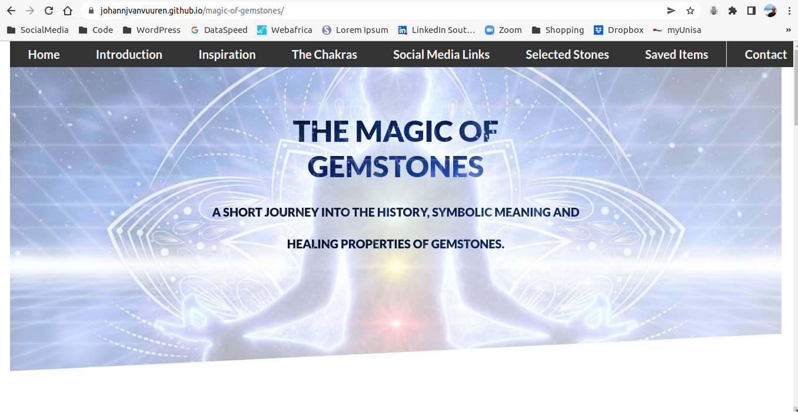
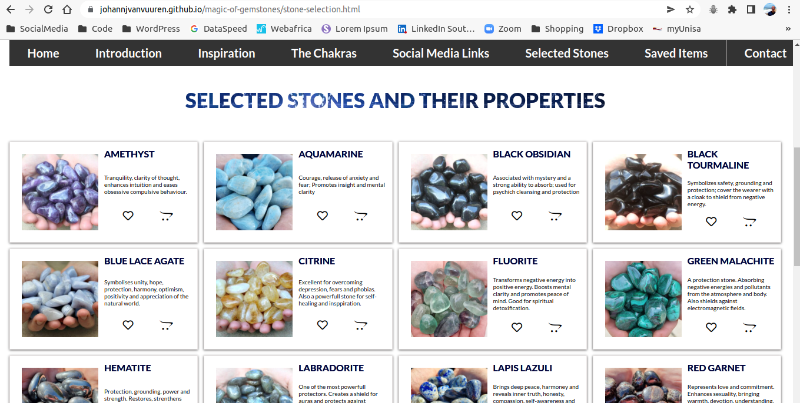
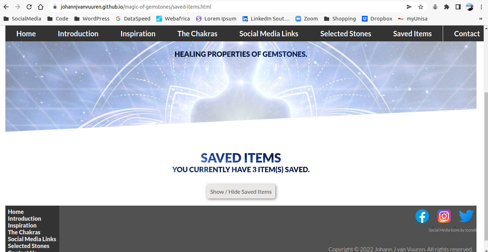
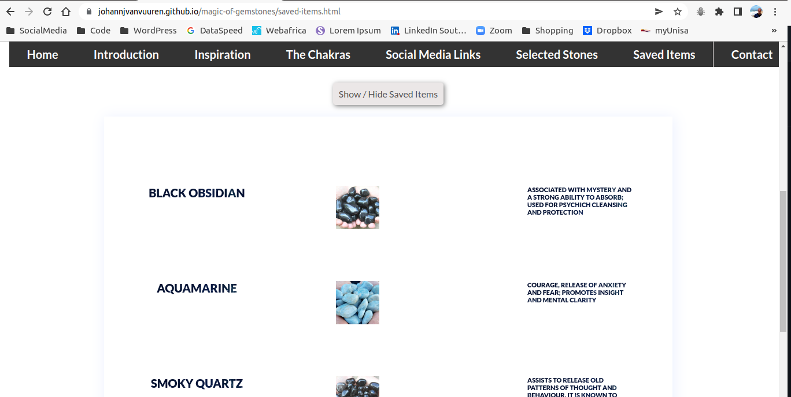

# The Magic Of Gemstones

### 1. Introduction

This is a small website that introduces the visitor to the fascinating world of gemstones. It has a specifically esoteric focus on the meaning and use of stones in alternative holistic healing.

The website was created as a capstone portfolio project, forming part of the HyperionDev Immersive Full-Stack and Software Engineer Bootcamp. Its purpose was to showcase the cumulative skill in HTML5, CSS3 and JavaScript coding that has been built up towards the end of level 1 of the bootcamp. As the bootcamp progresses, the capstone projects are built upon to consolidate and incorporate new skills as they are required.

## Index
1. Introduction
2. Installation
3. Usage
4. Credits

### 2. Installation

There are no special installation instructions for this project. The files can be downloaded as a ZIP file and extracted. The folder structure should be kept **exactly** how it is and the website can then be viewed by opening the `index.html` file.

It can alternatively also be accessed via the following [link](https://johannjvanvuuren.github.io/magic-of-gemstones/).

### 3. Usage

The website is very easy to navigate. All sections can be accessed via the **navigation bar** at the top of the page. This navigation bar is fixed and always visible.  

.

There is a stone selection page where items can be **liked** and **unliked** and then **saved** for future reference as needed. This is done by clicking in the **heart** and **shopping cart** icons respectively.  

.

Once a selection has been saved, the selection can be viewed at a later point on the saved items page.

The saved items can be **hidden or revealed** for the convenience of the user. This is done by way of a button that is clicked:  

.

Once the button is clicked, all items are revealed and when clicked again, the items will be hidden again.  

.

Finally, there is also a **contact** and **newsletter subscription** section to the page to give it a bit of an interactive flavour.  

.

.

A lot of these features have been designed with the aim of converting the website to an **e-commerce** site at some later point.

### 4. Credits

This website was designed and conceived by Johann Jansen van Vuuren under the guidance of HyperionDev.
